# Differential End Current Starved Voltage Controlled Oscillator (VCO)

This repository presents the design of Differential End CSVCO implemented using Synopsis Custom Compiler on 28nm CMOS Technology.

# Table of Contents
 * [Introduction](#Introduction)
 * [Current Starving Technique](#Current-Starving-Technique)
 * [Differential End Current Starved VCO](#Differential-End-Current-Starved-VCO)
 * [Tools Used](#Tools-Used)
 * [Pre-Layout Schematics and Simulations](#Pre-Layout-Schematics-and-Simulations)
 * [Netlist of the Circuit](#Netlist-of-the-Circuit)
 * [Observations](#Observations)
 * [Author](#Author)
 * [Acknowledgements](#Acknowledgements)
 * [References](#References)

# Introduction:

In VLSI System Design, Phase Locked Loop (PLL) is an essential building block for many timing generator applications. It comprises of five essential blocks which are Phase Frequency detector, Charge Pump, Low pass filter, Voltage controlled oscillator and Frequency Divider. Among many different oscillators, LC and ring oscillators are the most commonly used ones. The LC VCO occupies more area, and the tuning range is very narrow. Ring VCO provides a wide tuning range, less power consumption with less area. Among many types of Ring oscillators, Current starved VCO offers a balance between the power, area, phase noise with wide tuning range. In PLL, VCO is the most sensitive block to leakage power, and it will affect the performance of PLL to a more considerable extent.The scope of this work is to present a low power Current Starved Voltage Controlled Oscillator with Differential cross-coupled inverters as delay stages instead of regular inverters. Couple of benefits of using this Differential Cross coupled inverter is that: one, leakage power can be reduced thereby reducing overall power consumption and two, phase noise is reduced making this circuit stable; Hence can be used in space applications such as Radiation hardening of PLL.

# Current Starving Technique:

Ring Oscillators can be realized in different ways. The frequency of oscillation is inversely proportional to the number of delay stages and delay time (or) propagation delay of each stage. The main disadvantage of normal ring VCO is that there is no different supply and control voltage, but supply voltage is considered as the control voltage. The drawback for normal ring VCO circuit is that as the supply voltage decreases the amplitude also decreases. To overcome this disadvantage, we are going for current starved technique. The current starved technique utilises the principle of current mirror. Current mirror is a technique where corresponding voltage is converted into current. The same magnitude of current is supplied to various branches as shown in figure.

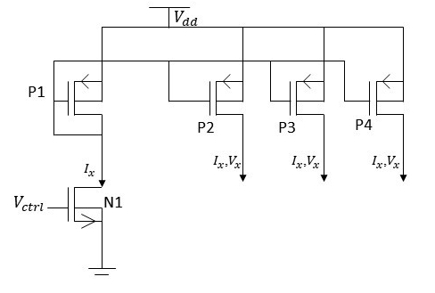 
  Fig. 1: Current Mirror 

As the control voltage increases, the amount of current flowing through circuit also increases, hence increasing the switching speed of delay cell, thereby increasing oscillation frequency.

We can explain advantage of current starved technique in two parts which are:-

1) Why amplitude of oscillation is constant for varying control voltage.
2) How are we limiting current and hence saving power.

First, let us consider the first point (1) thinking in terms of voltage. When control voltage is above threshold, N-MOS or N1 in current mirror will be in active region and conducts efficiently, hence potential of ground is available at gate of P-MOS which activates the corresponding P-MOS as well. Since, all the gates of P-MOS are P1,P2,P3…Pn are interconnected and operating all the P-MOS in active region. This will make Vx=Vdd. Due to this reason the amplitude of oscillations is maintained for different frequency.
Now, considering second point (2) we think in terms of current. We know that in N-MOS as gate potential increases conductivity of N-MOS increases, so as control voltage increases the amount of current(I) flowing through N-MOS also increases. Hence, the current flowing into delay cells also increases as it is part of current mirror. Therefore, we can limit the amount of current flowing into circuit thereby saving power.

The frequency of oscillation of the Voltage Controlled Oscillator is given by:

           f = 1/2Nτ
           
    Where, N = Number of stages 
           Ʈ = Propagation delay of the cell
           
Total capacitance at the drain of M2 and M3 is given by

           Ctotal(t) = Cin + Cout
           Ctotal(t) = Cox(WpLp+WnLn) + 3/2Cox(WpLp+WnLn)
           Ctotal(t) = 5/2 Cox(WpLp+WnLn)  
           
    Where, Cout and Cin represent the input and output capacitance of inverter respectively.
           Wp and Wn are the widths of PMOS and NMOS respectively. 
           Lp and Ln are the lengths of the PMOS and NMOS respectively. 
           Cox is the oxide capacitance of the transistor.
   
So, the final equation will look like,

           Ʈ = Ʈ1+ Ʈ2 = Ctotal*Vdd/Id
           f = Id/(N*Ctotal*Vdd )
           
    Where,	f = Frequency of oscillation of VCO,
	   	N = Number of stages of delay in VCO,
	   	Ctotal = Total internal capacitance of the circuit,
	   	Vdd = Supply voltage of the circuit,
	   	Id = ain Current of the MOSFET

# Differential End Current Starved VCO:

The fig. 2 represents the differential inverter in which M1 and M2 form an inverter and M3 and M4 form another inverter. They act as two different inverters with the same power supply. We use this inverter as building block for forming the current starved differential VCO.

  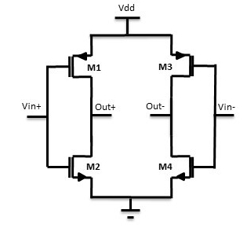 
  Fig. 2: Differential Delay Cell

In the Current Starved Differential VCO, the delay stages are replaced by differential delay cells. The current starved Differential VCO is shown in Fig. 3. The bottom two NMOS in the delay forms the pull-down network. M4, M5, M6, M7 forms one delay cell. The three number of delay cells are used to build a VCO to increase the oscillation frequency and gain. By using differential delay cell, the leakage power can be reduced with a lesser Phase Noise.

Coming to the working of the current starved differential VCO when the control voltage is above threshold voltage the MOSFET M1 starts conducting and the current mirror MOSFETs M1, M2, M3, M9, M15 comes into active region. Also the differential inverter switched on because the MOSFETs M3,M9,M15 starts conducting. In the CSDVCO the out+ -> in- -> out- ->  in+ -> out+ -> in+ form a loop and the other set forms another loop. The input keeps on inverting from one stage to the next and hence the VCO starts generating oscillations. And as the control voltage increases the frequency of oscillations also increases linearly as in the case of a conventional VCO.

  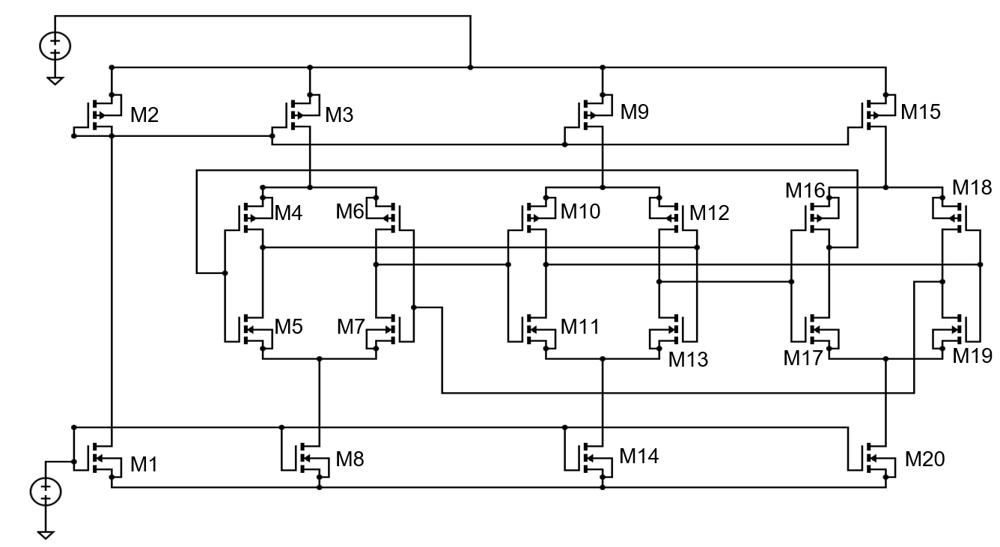 
  Fig. 3: Differential End Current Starved VCO

# Tools Used:

<b>• Synopsys Custom Compiler:</b> 
&emsp;The Synopsys Custom Compiler™ design environment is a modern solution for full-custom analog, custom digital, and mixed-signal IC design. As the heart of the Synopsys Custom Design Platform, Custom Compiler provides design entry, simulation management and analysis, and custom layout editing features. This tool was used to design the circuit on a transistor level.

<b>• Synopsys Primewave:</b> 
&emsp;PrimeWave™ Design Environment is a comprehensive and flexible environment for simulation setup and analysis of analog, RF, mixed-signal design, custom-digital and memory designs within the Synopsys Custom Design Platform. This tool helped in various types of simulations of the above designed circuit.

<b>• Synopsys 28nm PDK:</b> 
&emsp;The Synopsys 28nm Process Design Kit(PDK) was used in creation and simulation of the above designed circuit.

# Pre-Layout Schematics and Simulations:

## Schematics:

### Differential Delay Cell:
Initially Schematic of the Differential Delay cell was implemented and converted into a symbol so that it could be used directly as delay cell from the library.

  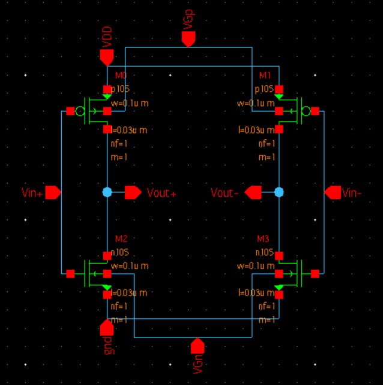 
  Fig. 4: Differential Delay Cell Schematic

  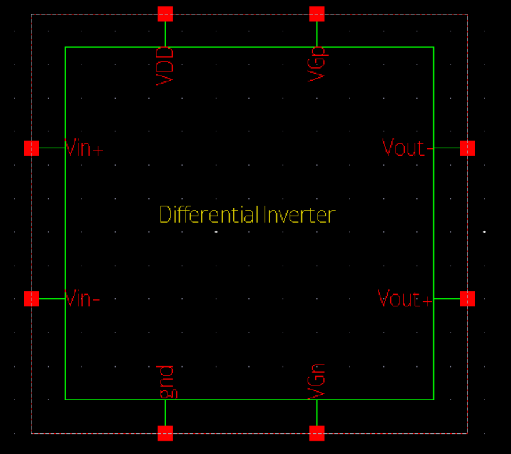 
  Fig. 5: Differential Delay Cell Symbol

### Buffer:
This component is used to convert the generated sine wave to a proper square pulse and is placed at the output of the VCO. This is nothing but a couple of inverters placed in series. 

   
  Fig. 6: Buffer Schematic

  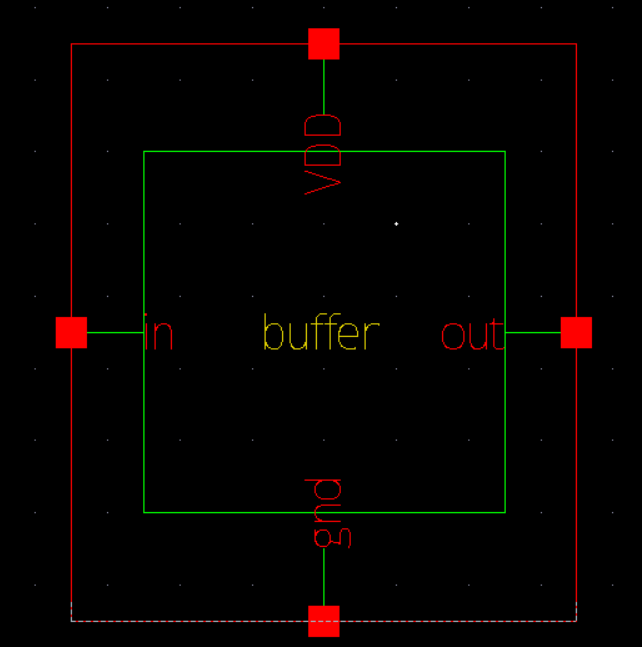 
  Fig. 7: Buffer Symbol

### Differential End Current Starved VCO:
The schematic of Differential End CSVCO has been created using the above cells and a few transistors as shown in the below figure.

  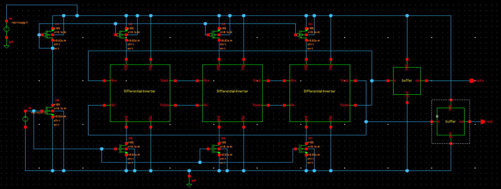 
  Fig. 8: 3-Stage Differential End Current Starved VCO Schematic

  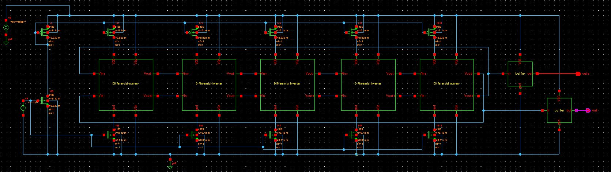 
  Fig. 9: 5-Stage Differential End Current Starved VCO Schematic

## Simulations:
### Transient Analysis:
After creating and saving the schematic go to 'Tools' and open 'Primewave' to start the simulation. In the Primewave select the 'model file' i.e the '28nm PDK's .lib file presentin the HSPICE folder. After this select the 'tran' analysis in the analysis window and give the 'Start', 'Stop', and 'Step Size' parameters and save it. Then add the outputs which needs to be plotted by selecting the nets on the schematic. 
One other thing we need to keep in mind is that here we have loop for which an initial condition needs to be declared. For that, we have to go to 'Setup -> Convergance aids' and select the net for which we want to set an initial condition.Then go to 'Simulations -> Netlist and Run' to generate a netlist and run the simulation to get the below output.

  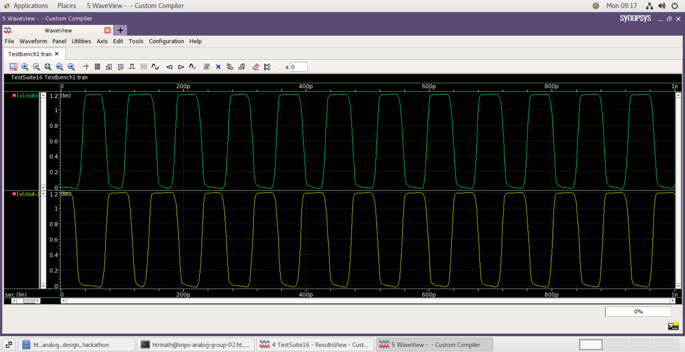 
  Fig. 10: Differential End Current Starved VCO Transient Analysis

The output frequency for the above graph is 'fout = 12.406 GHz' ('Vctrl = 500mV' and 'Vsupp = 1.2V')

### Parametric Sweep:
This is basically used to plot any output attribute over varying input attribute. Specific to this design we are going to vary the control voltage and supply voltage to plot the varying frequency. For this, in the schematic we have to give a variable in the 'DC Voltage' parameter of the VDC components. Then add this variables in the Primewave under variables window and select 'sweep' in that window for each variable. In the parametric sweep window give the 'Start', 'Stop' and 'Step Size'. In the outputs add the function to calculate frequency and run the simulation to get the below output.

   
  Fig. 11: Control Voltage vs Frequency graph for 1.2V Supply Voltage in 3-stage Differential End CSVCO.

  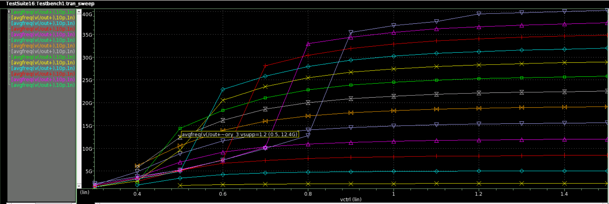 
  Fig. 12: Control Voltage vs Frequency graph for varying Supply Voltage in 3-stage Differential End CSVCO.

  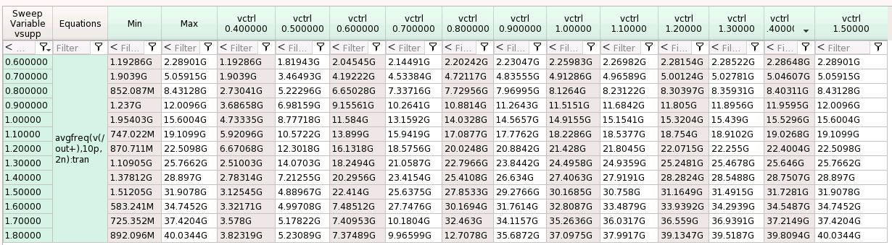 
  Fig. 13: Control Voltage and Frequency table for different Supply Voltage values in 3-stage Differential End CSVCO.

  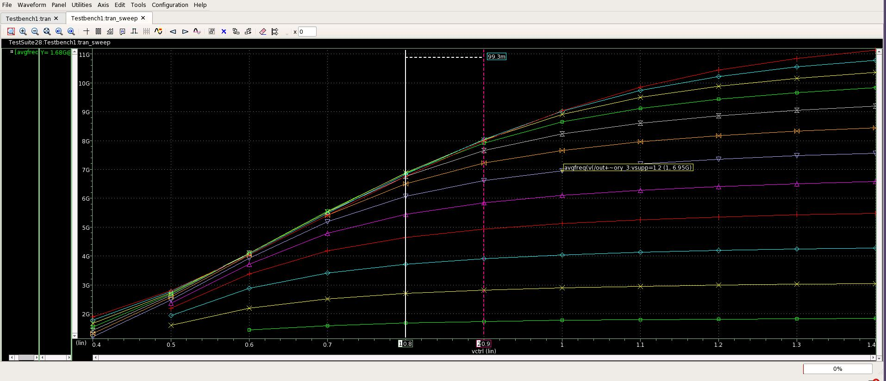 
  Fig. 14: Control Voltage vs Frequency graph for varying Supply Voltage in 5-stage Differential End CSVCO.

  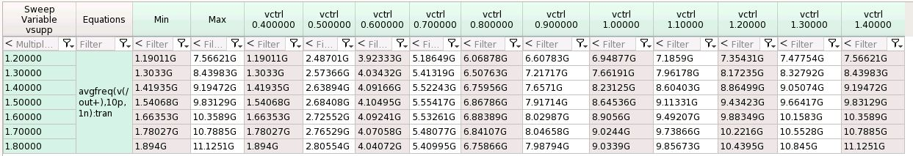 
  Fig. 15: Control Voltage and Frequency table for different Supply Voltage values in 5-stage Differential End CSVCO.

# Netlist of the Circuit:

Refer to the netlist of the 3-Stage Differential End CSVCO here: <a href='differential_CSVCO.cir.out'>Netlist</a>

Refer to the netlist of the 5-Stage Differential End CSVCO here: <a href='Differential_csvco_5stage.cir.out'>Netlist</a>

# Observations:
• Maximum frequency obtained for Supply voltage of 1.2V in 3-Stage Differential End CSVCO is around 22 GHz 
• As expected the bias current flowing into the delay stages is increasing as the the control voltage is increasing. 
• Also as expected the VCO's output frequency is increasing as the control voltage is increasing. 
• It can also be observed as the number of delay cells increase the frequency of oscillation decreases. 
• One other thing to be noted is that in the parametric sweep we can see that the 5 stage VCO's graph is more linear as compared to the 3 stage VCO's graph which means that the 5 stage VCO is more stable and has better phase SNR. 

# Author:
• Trinath Harikrishna, B.Tech(ECE), SRM Institute of Science and Technology, Kattankulattur, Chennai-603203.

# Acknowledgements:
• <a href='https://www.iith.ac.in/events/2022/02/15/Cloud-Based-Analog-IC-Design-Hackathon/'>Cloud Based Analog IC Design Hackathon</a> 
• <a href='https://www.synopsys.com/'>Synopsys India</a> 
• <a href='https://www.vlsisystemdesign.com/'>VLSI System Design (VSD) Corp. Pvt. Ltd India</a> 

# References:
[1] B. Razavi. A 2-GHz 1.6-mW phase-locked loop. IEEE Journal of Solid-State Circuits 1997; 32 (5): 730-735. 
[2] R.Rahul and R.Thilagavathy, "A low phase noise CMOS voltage-controlled differential ring oscillator,"ICCICCT,2014
